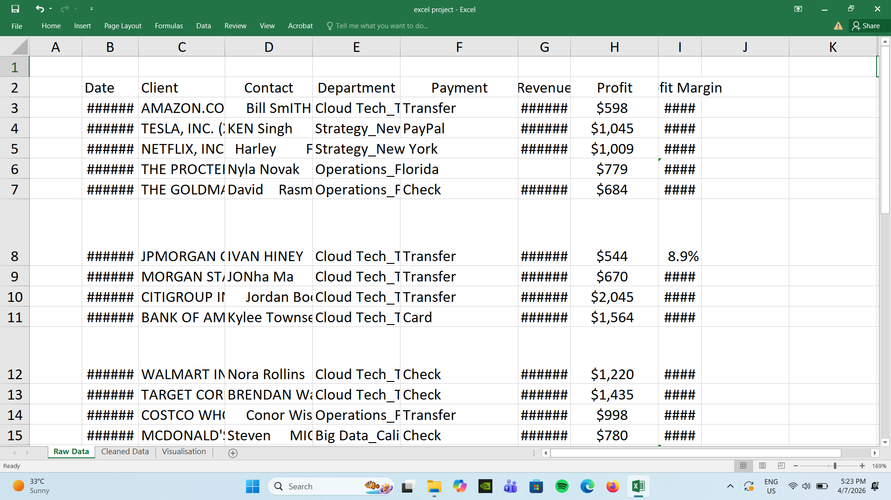
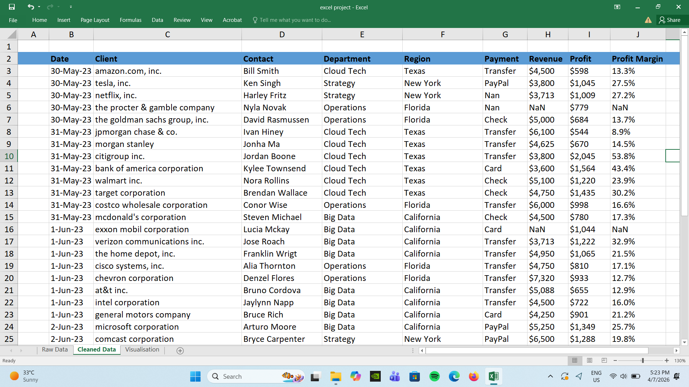
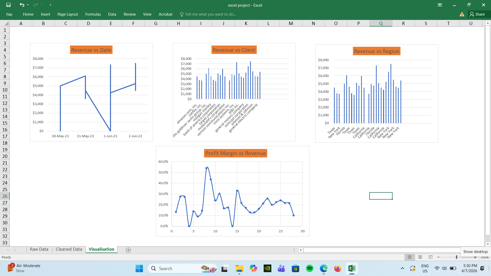

# 📊 Excel Sales Analysis Dashboard
## 🧾 Overview

Problem statement - This project focuses on analyzing messy sales data using Excel. The goal was to clean the dataset, build a clear dashboard, and extract meaningful insights about revenue and profitability.

## What I Did
1)Cleaned and organized raw, inconsistent data 
2)Handled missing values and improved data structure 
3)Used Excel features like Pivot Tables and charts 
4)Built a simple and interactive dashboard 
5)Analyzed patterns to understand business performance
## Key Insights
1)Most of the revenue comes from a few major clients like Dell and Chevron, showing high dependency on them 
2)New York is the top-performing region, contributing significantly more revenue than others 
3)Some companies generate high revenue but have low profit margins, indicating higher costs 
4)Companies like Citigroup show strong profit margins, reflecting better efficiency 
5)A few missing or inconsistent values in the dataset could affect analysis accuracy
## Recommendations
1)Focus on improving profit margins for high-revenue but low-profit clients 
2)Try to reduce dependency on a small number of clients by diversifying the customer base 
3)Investigate cost-heavy areas to improve overall efficiency 
4)Ensure better data collection to avoid missing or inconsistent values in future
## Tools Used
Microsoft Excel
Data Cleaning
Charts & Dashboard

